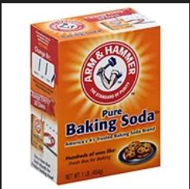
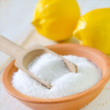
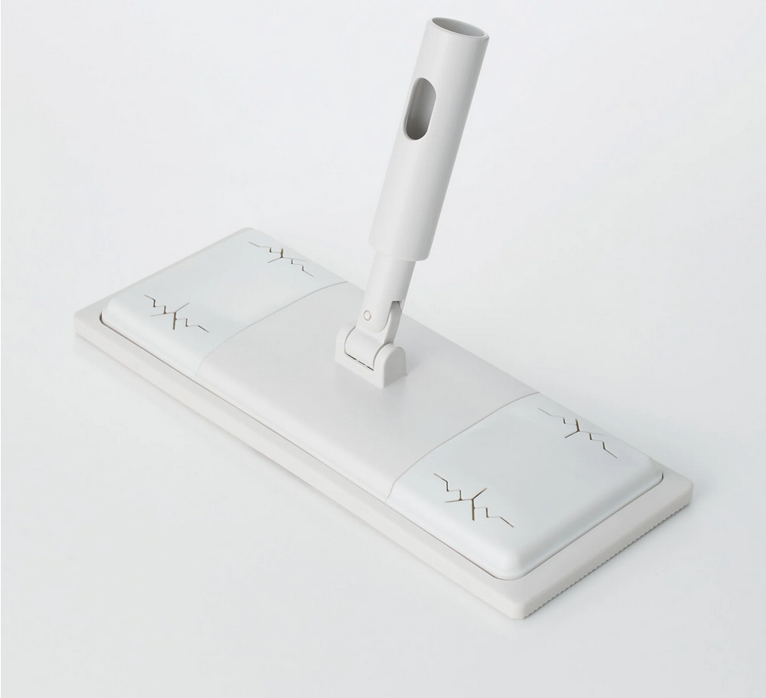
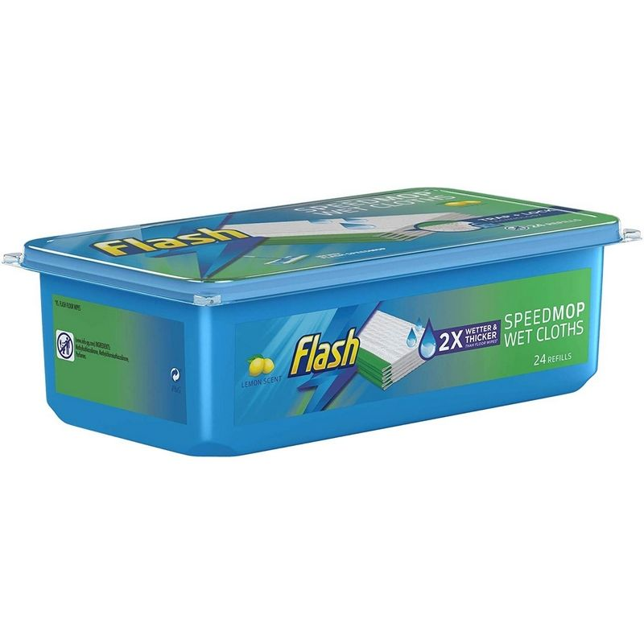

<!-- markdown-toc start - Don't edit this section. Run M-x markdown-toc-refresh-toc -->
**Table of Contents**

- [Casual Guide to Cleaning](#casual-guide-to-cleaning)
    - [Dishes](#dishes)
    - [Cookware](#cookware)
        - [Aluminum Pots and Pans:](#aluminum-pots-and-pans)
        - [Glass:](#glass)
        - [Stainless Steel:](#stainless-steel)
    - [Stove top](#stove-top)
        - [Regular Clean](#regular-clean)
        - [Deep Clean](#deep-clean)
    - [Any surface above the floor](#any-surface-above-the-floor)
    - [Floor](#floor)
        - [Wooden Floor](#wooden-floor)
        - [Tiles](#tiles)
    - [Toilet](#toilet)
        - [Scientific Guide to avoid pee splashing](#scientific-guide-to-avoid-pee-splashing)
            - [Fool Proof way #1](#fool-proof-way-1)
            - [Fool Proof way #2](#fool-proof-way-2)
            - [Picture Guide and Detailed explaination](#picture-guide-and-detailed-explaination)
    - [Cloth-based](#cloth-based)
        - [Sofa](#sofa)
        - [Bean bags](#bean-bags)
        - [Laundromat](#laundromat)
    - [Trash](#trash)
        - [Food waste](#food-waste)
        - [Dirty containers](#dirty-containers)
        - [Packaging](#packaging)
    - [Cleaning Tools](#cleaning-tools)
        - [Baking Soda](#baking-soda)
        - [Citric Acid](#citric-acid)
        - [Bleach](#bleach)
        - [Robot Vacuum](#robot-vacuum)
        - [Vacuum Cleaner](#vacuum-cleaner)
        - [Cleaning Mop](#cleaning-mop)
- [Addition: Casual Guide to Roommate (Lite)](#addition-casual-guide-to-roommate-lite)
    - [Sound Level](#sound-level)
    - [Things in house that is used constantly and it'll be kinda, really, super nice if all members contribute and check on them](#things-in-house-that-is-used-constantly-and-itll-be-kinda-really-super-nice-if-all-members-contribute-and-check-on-them)
    - [The End](#the-end)

<!-- markdown-toc end -->
# Casual Guide to Cleaning
Is your standard of cleanliness just "it doesn't *look* dirty, its fine"?
Getting complaints but not sure where to start?
Roommates you lived with before are Lovecraft's fish people from the London sewage?
In this **Casual Guide to Cleaning**, we channel our experiences in childhood trauma to give tips on how to clean properly!

## Dishes
Bacteria will stay alive on surfaces, even clean surfaces, for up to four days. When you leave dishes in the sink, you're building a concoction of bacteria soup, which can be the cause of a myriad of gastrointestinal problems. As a completely unrelated side note to bacteria and cross contamination, I get sick easily. *So no pressure, the blood is on your hands~*

When hand washing dishes: 
- Have the water as hot as you can bear (Or wear rubber gloves)
- Use detergent and some sort of scrub like sponges so you are ***actually*** removing the food particles with brute force. 
  - Brushes should be reserved for big messes that would clog a sponge.
- **ACTUALLY PUT YOUR HAND ALONG THE SURFACE OF THE DISHES TO CHECK IF YOU CLEANED THEM PROPERLY!!!**
  - Feel Oily? WASH IT AGAIN
  - Feels a weird wet bump? THAT'S FOOD BITS STUCK ON IT
  - Feel Soapy? UNLESS YOUR DIET includes SOAP, WASH IT AGAIN
- Use a clean dish cloth

After Dishes are done:
- **Place the washed dishes face down**, so the water doesn't linger on the dishes
- **Squeeze the sponges and shake the brushes dry**. Wet sponges are perfect breeding grounds for bacteria, and bugs *love* to lay their eggs in dripping water pools filled with nutritious food bits.
- Dump out the sink filters to **to the trash**

How to clean dish cloth: 
- Wash and rinse the cloth after washing it with cleaner
- **Please make sure the cloth is soap free.** If you let the cleaner solution dry with the cloth the rag will quickly become brittle.
- Microwave for a minute to sterilize.

Wash your hands after touching the dishes, especially days old dishes. Don't cross contaminate.

## Cookware
**Nonstick:**

Nonsticks are great for beginners because they can easily be cleaned with hot water, dish soap, and a soft sponge. 
Soaking Nonsticks in soapy water for long periods of time can corrode the surface, so wash them quickly! 
Scrub them in baking soda and water paste for tougher stains.

### Aluminum Pots and Pans:

So, this is awkward, while researching I discovered that Baking Soda can damage Aluminum cookware. The alkaline sodium bicarbonate reacts with the aluminum and can cause your pots and pans to discolor. While its okay for a quick rinse, if I ever let it sit in the pots, apparently that's bad. Oof, you learn new things everyday... 

### Glass:

Glassware is wonderful but be careful in using it with high and low heat. If mishandled it can explode. 

### Stainless Steel:

Overheating Stainless Steel pans for long periods of time can cause discoloration. Say, if you over boil water, that will cause discoloration.
Hmmm, I wonder why the pan looks so discolored after being used by someone. What a mystery...

## Stove top
It is important to keep the stove top clean. When cooking there's often spillage and oil splatters. Cleaning them once they've dried is hard.
### Regular Clean
- After cooking, wait for the stove to cool to avoid burns. 
- Any water, oil, food stains are to be removed with a slightly wet sponge.
- If the stain cannot be removed, use a cleaner, **THEY ARE UNDER THE SINK CABINET**, look at them, ask.

### Deep Clean
We do this every 2 or 3 months.

## Any surface above the floor
What is any surface above the floor? Tables, Counter tops, Shelves...Any surfaces exposed in the open that are horizontal.
## Floor
For dry messes, the cleaning instructions are nearly identical. Yes, we do have a [robot vacuum cleaner](#robot-vacuum), but he only does so much for the floors that he can reach, and he should really only have to worry about normal household dust, and maybe hair that falls on the ground. We have a broom and dustpan wedged between the fridge and tall shelf, as well as a [compact vacuum cleaner](#vacuum-cleaner). Either one should be plenty for most dry messes. 

Wet messes are more complicated, and different surfaces require different types of attention, detailed below.

### Wooden Floor
3 things wooden floors don't like:
1. Water: Water contact can corrode wooden floors if not cleaned immediately.
2. Heavy, Sharp Objects: Wooden floors scratch easily, a scratched wooden floor can have dirt and grime or moisture stuck in them. 
3. Dirt and Grit: Self explanatory. 
Sweep or vacuum the floor. **CHECK UNDERNEATH REACHABLE FURNITURE or CORNERS.**
Use a microfiber cloth mop and wipe the floors. When cleaning with a mop, don't over wet the cloth. 

### Tiles
Tiles have grooves so vacuums can't reach as well. Use a broom for more control.

## Toilet
I grew up with two brothers. Certain old man I know still make this mistake and he's 60 by the time of writing. If you are not over 60, your aim can improve is what I am saying. Accidents happen, but if they happen every other week then it's a skill issue.

### Scientific Guide to avoid pee splashing

#### Fool Proof way #1
Just wipe the toilet seat everytime you pee or poop. Witches do this during their monthly blood letting ritual to ensure no blood gets on the toilet seat. 

#### Picture Guide and Detailed explaination
First, Lift the Toilet Seat.

Aim for the steepest part of the bowl near the water, that's easiest to hit/offers the biggest surface to tolerate wandering. In the following image this would be to aim for the green dot, and you have the entire panel within the blue dots to cope with wandering. The pink dots at the sides and front would also work and are "better" because they're steeper but "worse" because they are harder to hit. If your aim is really good and really consistent go for pink, otherwise green is a better compromise between steepness and ease.

Last, Close the Toilet lid with the seat.

**Remember wash your hands! Hope this guide helps.**

## Cloth-based 
### Sofa
Use the handheld vacuum to vacuum the sofa. 
- Do a once over for visible surfaces.
- Vacuum under the sofa cracks.

Our sofa slipcovers can be machine washed when taken off. Which usually cleaned once a month, but if you sweat or eat food on the couch regularly, then please consider bi-weekly clean by taking the covers off and wash them at the laundromat.

### Bean bags
The covers for the bean bags can be taken off and washed at the laundromat as well. 

### Laundromat
Please do not kill the washer by overloading the high pressured washing machines with soap, high pressured washing machines requires less soap that normal washing machines. We only have 1 good laundromat close by. There are instructions in the laundromat on how to use the machines. Follow them, please. The laundry machines have seen enough abuse. Please don't perpetuate the cycles of abuse, only the cycles of cleaning. 

## Trash
**If the trash reaches the top PLEASE TAKE THE TRASH OUT, you don't have to wait till the trash it absolutely stuffed that you can't close the lid.** We are not college kids playing hot potatoes with the garbage disposals anymore. You don't want smells, I don't want smells, and keep the trash lid closed unless you want a fly infestation.

### Food waste
If you have a lot of food waste, dump it in the plastic bag the takeout came with, tie the plastic bag, throw it in the trash. If its **A LOT A LOT,** throw it in the trash bin outside (Put it inside the Malden Trash Bag then put it in the outside trash bin.). I know it seems like leaving it in the takeout containers is enough, *but under heat and moisture the food waste will start to smell and leak out over time.* Takeout container lids can be flimsy as well.

### Dirty containers
If you have a lot of dirty containers, slightly wash out the food scraps and dries them. Stack them so it doesn't take up so much space in the trash. 

### Packaging
- Flatten the paper boxes
- deflate the air packets
- Foam materials are RECYCLING
- If you have so much of them it constitutes another bag, **use another bag**. Don't fill up the trash immediately and leave your roommates to deal with them.

## Cleaning Tools
### Baking Soda

Sodium Bicarbonate is actually a salt. Because Baking Soda's pH is higher than neutral, it is slightly basic (the opposite of acidic.)
Here's what Baking Soda can do:
- It absorbs odors: Most smells are acidic and baking soda reacts with acids to neutralize them.
- Ever seen a baking soda volcano? Basically that explosion used on a smaller scale can unclog drains and cut through grease.
- It is slightly abrasive, the grittiness of the baking soda makes it easier to dislodge particles and stains.

### Citric Acid

Citric acid is basically the acidic partner for baking soda. It is a weaker version of cleaning alcohol that is food safe.
There's a lot of things you can do with it, search it up if you are interested.

### Bleach
Bleach is extremely strong, only use it for things like the toilet and deep cleaning the stove. Don't use it with any bowls or plates  

### Robot Vacuum

We have a prototype of the Shark RV850 Robot Vacuum Cleaner, affectionately named Goob. Being a prototype, he's missing the hardware necessary to be as smart as the finished product, but we love him very much. He is programmed to run every Monday, Wednesday, and Friday at 5pm, and will derp around from room to room cleaning up whatever is in his path. He doesn't do a perfect job, but he is a massive help in keeping the house clean.

He will need to be emptied out into the trash can at least once a month. The canister is on the back, which hinges open. The filter inside should also be tapped clean.

### Vacuum Cleaner

This vacuum cleaner is light duty, meant for dust, and maybe some small debris. Luckily, that's pretty much as bad of a dry mess as we can really produce in this house.

After each use, the canister should be emptied into the trash can, and the mesh filter should be washed (careful not to damage the filter while washing). Since this is a cleaning tool, the filter should be left to dry in the bucket that's kept near the back door. Once the filter is dry, reassemble the vacuum cleaner so it's ready for the next use.

### Cleaning Mop

This kind of mop is great, it can be used for wet or dry cleaning of flat surfaces depending on the cloth/pads you use. We have a microfiber cloth and refill pads. 
Wet mopping should only be done after sweeping or other forms of removing dust, since the wet pads will clog quickly before being able to do their job.

# Extra: Casual Guide to Roommate (Lite)
Remember College Dorm rules? Clean the dishes. Take turns to buy toilet paper (Don't risk your life for it tho). Quiet Hours after 10 pm. Clean the microwave regularly. Rules are dumb, respecting them sounds annoying, don't we all dream of not being bound by rules growing up?

Well, congrats most of us are luckily not in college anymore. (One of us is an imposter.) But boy do those basic things haunt us, and will probably continue to haunt us until one of us move out to a fine single luxury housing with a butler to serve your every whim. In the event of any of us winning the lottery just know that I never doubted the winner will win and they're the coolest person ever, now please pay my student loans for me.

## Sound Level
For security our marching band steps and door slams ensures no robbers will appraoch this house. We need to upheld the proud tradition of being an upstairs neighbors of course! Stomp our feet to the beat of the drum, march towards a better future!

Seriously tho, noise is relative, and all three of us are typically quiet unless there's visitors. So footsteps, when striking the ground **heel first**, can literaly shake the ground and everyone in the house can hear it with the door closed. Please watch this: https://www.youtube.com/watch?v=nH5VDhdhHyk

Thank god we don't have downstairs neighbors. The landlord did just put the first floor out hoping someone will rent them. We don't live in Germany where the walls and floors are thick. In America we like our freedom with no privacy because our walls are literaly cardboard and our floors made of hollow waffles.

To illustrate how bad the sound proofing of this house is,
Any TV sound level above 20 can be heard clearly from every room of this floor except the bathroom with the fans turned on.

## Things in house that is used constantly and it'll be kinda, really, super nice if all members contribute to ensure they are stocked
- Malden Trashbags
- Paper Towels
- Toilet Paper
- Alcohol Wipes (Lynsol Wipes)
- Tissue Paper
- Napkins
- Dish Soap
- Sponges
- Cleaners like Baking Soda, Cleaning Alcohol...etc
- Laundry Soap, Laundry Sheets
- Batteries

**According to an ancient myth, if you ever pay attention any of these depleting and replensihing magically in a house you will have good luck forever <3 The little leprechauns check on them bi-weekly and stock them with their personal income.**

## The End
I know that if you've never really taught to notice this before it can feel daunting, but since asking questions as you go might feel awkward because you might not know where to start, really the best way to learn is to do them. Clean the sofa, your own room, and try cleaning the stove top after you cook. **ASK IF YOU DON'T KNOW HOW OR WHERE OR WHY, ASK SOMEONE or GOOGLE!!!!**

If you are wondering why your roommates can be so mean, its because their independent living abilities are taught by these two wise teachers in their lives:

*(Imagine the following dumb line in an old man voice) Back in my day, we make children our dish washers and scream at them if they make a mistake and then condescend them. Now they can clean after themselves well but now need therapy. They are so weak.*

*(Imagine the following line in a sweet grandma's voice) Don't worry dear, you just need to study and mom will do these for you. If you get a good job and school, you land yourself a good wife who will cook and clean for you. If your genitals are different I'll only ever tell you clean up after a men as a way to fulfill your life's duty and never talk to you about anything else until the day I die.*

So consider this, there are those who learn cleaning and living with another without trauma, your roommates are pretty useless to have standards that stresses them out when they not met. Feel powerful and proud being the Bogeyman that haunt their dreams. 

So if your roommates are not helpful because they are traumatized idiots. How to ask questions to yourself when routinely taking care of pesky hygiene? Here are some examples:

*Where is X supplies at? Lemme check the cupboards underneath the kitchen sink and the living room closet.*

*I think I covered all surfaces, let me count again.*

*Do I feel* **dust/oil/soap** *on my finger tips when touching this space I just cleaned and dried?*

*I wonder if this is the right cleaner, to ensure it doesn't damage the floor/furniture/object, let me search on Google.*

*Oh, we ran out of tissue/napkins/paper towels/trash bags, lemme go buy them.*

At the end of the day, it becomes a habit, and it becomes less daunting. And your roommates won't be hounding you like your mom anymore! Please, we're only 24 and 25, we're not ready to be nagging parents. Anyway, I'm saying that only positive outcomes can occur from cleaning more often. 

For the time being, please do consider hiring a cleaner every month or so. Be less traumatized and stressed, in a socialist society these tasks will be shared in a routine schedule in equal share, right now we must consider the power of money. 

Also consider a new place if your roommates become too unbearable and mean, where you live by your own rules instead of having to follow a useless guide of cleanliness that is 3000 words long and written by sleep deprived young adults in the course of a month.

**Happy Cleaning!**

